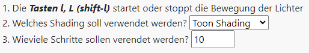
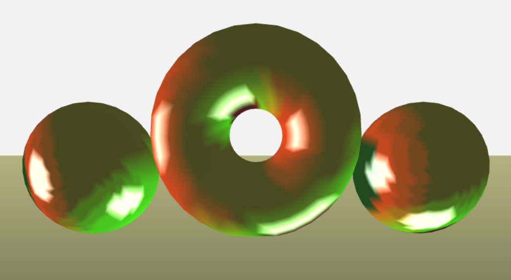

---

**Graphical Visualisation Technologies**

**Dozent: Prof. Dr. Felix Gers (Berliner Hochschule für Technik)**

**Studiengang Medieninformatik Online MA, Wintersemester 2022/23**

**University of Applied Sciences Emden/Leer, Faculty of Technology, Department of Electrical Engineering and
Informatics**

---

### Einsendeaufgabe EA8 - Lichter auf Kreisbahn mit Toon Shading

[zur Webseite](https://gvt.ckitte.de/ea8/)

Im Rahmen der achten Einsendeaufgabe sollen zwei Lichtquellen unabhängig voneinander auf einer Kreisbahn  um die dargestellte Szene kreisen.

Zur Lösung wurde eine Aufgabe der Lerneinheit Beleuchtung als Grundlage verwendet und erweitert. Zu sehen  ist ein rotes Licht, welches sich um die Y-Achse dreht, sowie ein Grünes Licht, welches sich um die Z-Achse dreht. Hierdurch kommt es zu Überschneidungen und einer additiven Farbmischung. 

Um den Effekt klarer erkennen zu können, wurde auf Mischfarben verzichtet. Das Zentrum der Punktlichter wurde zudem  etwas in den Vordergrund gerückt und seitlich verschoben, um das gründe Licht besser wirken zu lassen.  


Um den Tiefeneffekt zu verstärken, wird der resultierende Farbton mit der Z-Komponente von gl_FragCoord multipliziert.

```
void main()  
{            
    float zbuffer = fract(gl_FragCoord.z);
    gl_FragColor = vColor * vec4(zbuffer,zbuffer,zbuffer, 1.0);
}
```

Es existieren drei Möglichkeiten zur Steuerung des Programms:



Durch Drücken der Taste l oder L (shift-l) startet die Bewegung der Lichter, durch nochmaliges Betätigen stoppt sie. Über die DropDown Box (2) kann zwischen Phong-Shading und Toon-Shading gewechselt werden. 



Über das  Nummernfeld (3) kann angegeben werden, wieviele Schritte beim Toon-Shading verwendet werden sollen. Der  Bereich geht hierbei von 1 bis 50. Da für Schleifen im Shader ein konstanter Wert benötigt wird, ist  der Bereich hier begrenzt.

```
float stepDelta = 1.0 / uToonSteps;  
float curLimeValue = 0.;  

const float Counter = 50.;  

for(float i = 0.; i < Counter; i+=1.){  
    if(i < uToonSteps){  
        if(sn < curLimeValue){  
            diffuse = L * curLimeValue;  
            break;  
        } else {   
            curLimeValue+=stepDelta;  
        }  
    }  
}
```

Die Angabe der Schritte hat keinen Einfluss auf die Darstellung der Glanzlichter. Diese werden immer dargestellt. Wird ein Grenzwert überschritten, so wird das Glanzlicht in  Weiß ausgegeben.

```
if(rv < 0.9){  
    specular = vec3(0.,0.,0.);  
}  
else {  
    specular = vec3(1.,1.,1.);  
}
```

### Aufteilung des Codes

Der Code enthält zum Großteil den Code des Musterprogramms aus der Lerneinheit Beleuchtung.  Ergänzt wurde er um einen Startcode in **Startup.js**. Hier wird die Funktion **rotate** mit Hilfe von **RequestAnimationFrame** verzögert aufgerufen. Im folgenden wird sie regemäßig aufgerufen. 

Die Entscheidung, ob eine Translation berechnet und angewendet wird, erfolgt auf Grundlage der Variablen **animate**. Dies wird in Abhängigkeit von der Betätigung der **L-Taste** jeweils umgeschaltet. 

Die Berechnung der neuen Position findet in der Funktion **updateTransformation** statt. Hierzu werden lediglich die Koordinaten der Punktleuchten verändert. Notwendige Translationen zu deren Anzeige sind bereits im Musterprogramm vorhanden.

Die Steuerung des verwendeten Shadings erfolgt über die Variablen **shadin** und **toonSteps**, welche hierfür an den Shader als Uniform Variablen **uShaderTyp** und **uToonSteps** übergeben werden. Der relevante Code ist oben zu sehen.

Die Datei **main.css** enthält alle benötigten Klassen, um die Grafik einfach einzubinden. In der Datei **layout.css** wird das Layout der Webseite selbst festgelegt. Daneben kommt Bootstrap für die Buttons zum Einsatz.
